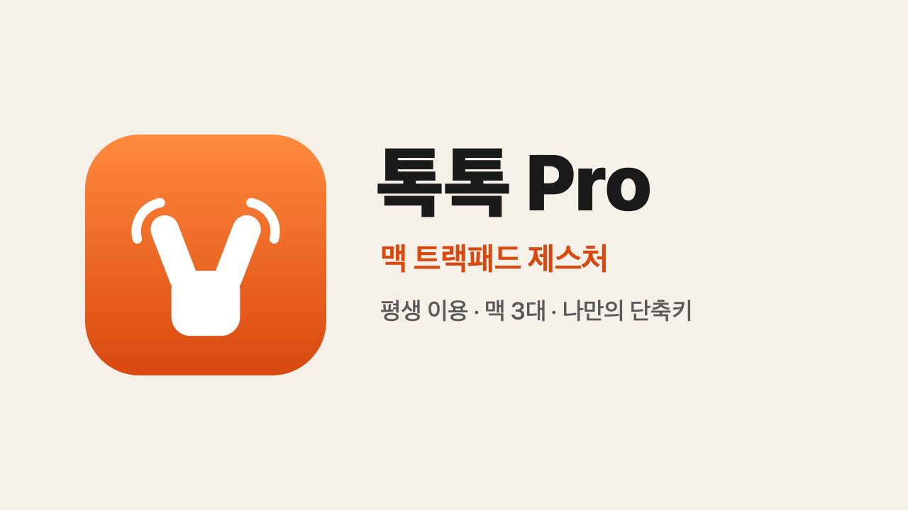

<p align="center"></p>

# 👆 TokTok (톡톡) — trackpad tap gestures for Mac

**Rest a finger on your trackpad and tap next to it.** Back/forward, tab switching, window snapping from the corners, volume & brightness sliders on the edges — just check a box and pick an action.

- 🌐 **Website & animated demos:** https://toktok.seoriarts.com/en
- ⬇️ **Download (notarized):** [latest release](https://github.com/hanseolhui/toktok/releases/latest) · `brew install --cask hanseolhui/tap/toktok`
- 🧩 **Open-source gesture engine:** [`TokTokCore`](#-open-source-gesture-engine-toktokcore) (MIT) — the recognizer behind TokTok's free gestures

---

## 🧩 Open-source gesture engine (TokTokCore)

A tiny Swift package that reads raw finger positions from every trackpad (via the private `MultitouchSupport.framework`, loaded at runtime) and recognizes:

| Gesture | How |
|---|---|
| `tipTapLeft` / `tipTapRight` | rest one finger, tap to its left / right |
| `twoFixTap{Left,Right,Middle}` · `threeFixTap{Left,Right}` | rest 2–3 fingers, tap beside or between them |
| `threeFingerTap` · `fourFingerTap` · `fiveFingerTap` | tap with several fingers at once |
| `corner{TopLeft,TopRight,BottomLeft,BottomRight}` · `edgeTopCenter` | one-finger tap in a corner / top-center |
| `swipeInBottomRight` | swipe from the bottom-right corner toward the center |
| `.slider(edge, up:)` | slide along the left/right (vertical) or top/bottom (horizontal) edge |

It keeps one detector per trackpad (fingers on two trackpads never mix), separates rest-and-tap from a normal two-finger tap (right click), ignores Magic Mouse surfaces, and rescans when a Magic Trackpad is connected.

```bash
git clone https://github.com/hanseolhui/toktok && cd toktok
swift run toktok-demo      # prints gestures as you tap
```

```swift
import TokTokCore

let trackpads = Multitouch()!
GestureDetector.sliders = [.right]
trackpads.onEvent = { event in
    if case .gesture(.tipTapLeft) = event { print("back!") }
}
trackpads.restart()
trackpads.watchDevices()
```

Keep the `Multitouch` instance alive (e.g. as a property) while you want gestures. `Tuning` exposes every threshold (tap duration, movement tolerance, corner size…).
The TokTok app adds the actions, settings UI and Pro features (double taps, title-bar gestures, custom shortcuts, per-app actions) on top — those parts are not open source.

⭐ If this is useful, a star helps a lot!

---

# 👆 톡톡 (TokTok)

**맥 트랙패드에 손가락을 대고, 옆 손가락으로 톡 — 뒤로 가기 / 앞으로 가기.**
세 손가락 탭 가운데 클릭, 모서리 톡 창 정렬까지. 가볍고 무료인 메뉴바 앱이에요.

```
 오른손 중지를 대고 검지를 톡  →  ⌘[  뒤로 가기
 오른손 검지를 대고 중지를 톡  →  ⌘]  앞으로 가기
```

## 🚀 설치

애플 공증을 받은 앱이라 받아서 바로 실행돼요. 유니버설(애플 실리콘 + 인텔), macOS 13 이상.

**방법 1. 다운로드** — [최신 릴리스](https://github.com/hanseolhui/toktok/releases/latest)에서 `TokTok.zip` 받기 → 압축 풀고 `TokTok.app`을 **응용 프로그램** 폴더로 옮긴 뒤 실행

**방법 2. Homebrew**

```bash
brew install --cask hanseolhui/tap/toktok
```

**방법 3. 터미널 한 줄**

```bash
bash -c "$(curl -fsSL https://raw.githubusercontent.com/hanseolhui/toktok/main/install.sh)"
```

**처음 한 번: 손쉬운 사용 권한 허용**
시스템 설정 → 개인정보 보호 및 보안 → **손쉬운 사용** → TokTok 켜기
(키 입력과 창 정렬을 하려면 필요해요) · 첫 실행 때 로그인 시 자동 실행이 켜져요.

> 오른쪽 ⌘ 한영키, 마우스 휠 등 다른 한국인 필수 설정과 함께 설치하려면 👉 [맥 한국인 필수 설정](https://github.com/hanseolhui/mac-korean-essentials)

## 🖐 제스처

메뉴바 ✌️ 아이콘 → **설정…** → **제스처** 탭에서 쓸 제스처만 체크하세요.

| 제스처 | 하는 법 (오른손 기준) | 기본 동작 | 기본 |
|---|---|---|---|
| 한 손가락 대고 왼쪽 톡 | 중지를 대고 검지를 톡 | 뒤로 가기 ⌘[ | ✅ |
| 한 손가락 대고 오른쪽 톡 | 검지를 대고 중지를 톡 | 앞으로 가기 ⌘] | ✅ |
| 두 손가락 대고 왼쪽 톡 | 중지·약지를 대고 검지를 톡 | 이전 탭 | |
| 두 손가락 대고 오른쪽 톡 | 검지·중지를 대고 약지를 톡 | 다음 탭 | |
| 두 손가락 대고 가운데 톡 | 검지·약지를 대고 중지를 톡 | 새로고침 | |
| 세 손가락 대고 왼쪽·오른쪽 톡 | 세 손가락을 대고 바깥 손가락으로 톡 | 왼쪽·오른쪽 데스크톱 | |
| 세 손가락 탭 | 세 손가락으로 동시에 톡 | 가운데 클릭 (포인터 아래 링크를 새 탭으로) | ✅ |
| 네 손가락 탭 | 네 손가락으로 동시에 톡 | 탭·창 닫기 ⌘W | |
| 모서리 톡 (4곳) | 한 손가락으로 모서리를 톡 | 창 왼쪽 반 · 오른쪽 반 · Mission Control · 창 가득 | |
| 위쪽 가운데 톡 | 한 손가락으로 위쪽 가운데를 톡 | 창 가득 | |
| 다섯 손가락 탭 | 다섯 손가락으로 동시에 톡 | Mission Control | |
| 오른쪽 아래에서 쓸기 | 모서리에 대고 가운데 쪽으로 쓱 | 새 메모 작성 | |
| 가장자리 슬라이더 ×4 | 왼쪽·오른쪽 끝은 위아래로, 위쪽·아래쪽 끝은 좌우로 | 밝기 · 볼륨 | |
| ⭐ 투탭 (Pro) | 모서리·위쪽 가운데·세·네 손가락 두 번 톡 | 4분할 · 다음 모니터 · 스크린샷 · 새 탭 | |
| ⭐ 제목 줄 제스처 (Pro) | 창 제목 줄에서 두 손가락으로 쓸기 · 오므리기 · 벌리기 | 반쪽 · 가득 · 가운데 · 4분할 · 최소화 · 전체 화면 | |
| ⭐ 스와이프 앱 전환 (Pro) | 한 손가락 대고 두 손가락 좌우로 | 앱 전환 ⌘Tab | |

- 대고 있는 손가락을 떼지 않고 계속 톡톡 치면 여러 번 실행돼요
- 두 손가락 탭(우클릭), 스크롤, 드래그와는 헷갈리지 않게 걸러요
- 모서리 톡은 '탭하여 클릭'을 켜 두면 클릭도 함께 일어나요
- 설정 창의 **기본 설정으로 되돌리기** 로 언제든 처음 상태로
- 설정에서 **언어(한국어 / English)** 를 바꿀 수 있고, **업데이트 확인 → 설치하고 다시 시작** 으로 한 번에 최신 버전이 돼요. **자동 업데이트**를 켜 두면(기본) 맥을 쓰지 않을 때 알아서 최신 버전으로 바꿔 둬요

## ⭐ 톡톡 Pro — 정가 ₩9,900 평생 · 맥 3대 (출시 기념 50% ₩4,950)

무료로도 제스처마다 **기본 제공 동작 42가지**를 자유롭게 고를 수 있어요.
Pro는 **투탭**, **제목 줄 제스처**, 모든 제스처에 **나만의 단축키**(여러 키 순서대로도), **앱 실행 · 단축어 실행**, **앱별 동작**, 슬라이더 가로 스크롤·확대/축소, 스와이프 앱 전환을 더해요.

1. [toktok.seoriarts.com](https://toktok.seoriarts.com/#buy) 에서 구매 (Gumroad · 카드 · Apple Pay · Google Pay)
2. 메일로 받은 **라이선스 코드**를 톡톡 설정 → **⭐ Pro** 탭에 붙여넣고 **등록**
3. 하루 한 번 온라인 확인 (인터넷 없이도 30일 유지). 맥 3대까지, 포맷해도 같은 코드로 다시 등록

📖 [사용 설명서](https://toktok.seoriarts.com/guide) · 💻 [기기 관리](https://toktok.seoriarts.com/manage) · ✉️ [코드 다시 받기](https://toktok.seoriarts.com/resend)

☕ 톡톡이 마음에 드셨다면 [개발자에게 커피 사주기](https://seoriarts.gumroad.com/coffee)

## ❓ 문제 해결

**제스처는 되는데 아무 일도 안 일어나요** → 손쉬운 사용 권한을 확인하세요. 목록에서 TokTok을 **−** 로 지우고 다시 허용하면 대부분 해결돼요.

**매직 트랙패드에서 안 돼요** → 연결하면 자동으로 찾아요. 안 되면 설정 → **도움말** → 다시 찾기

**인식이 이상해요** → 설정 → **도움말** → 디버그 로그 기록을 켜고 **의견 보내기**로 보내 주세요 (로그가 자동 첨부돼요)

## 🗑 삭제

메뉴바 아이콘 → 톡톡 종료 → 응용 프로그램 폴더의 `TokTok.app` 삭제 (Homebrew로 설치했다면 `brew uninstall --cask toktok`)

## 라이선스

- **TokTokCore** (이 저장소의 `Sources/`, 제스처 인식 엔진)와 `install.sh` 는 **MIT** 로 공개돼 있어요. 자유롭게 쓰고 고치고 공유하세요.
- **톡톡 앱**은 무료로 배포되는 앱이에요. Pro 기능(투탭 · 제목 줄 · 내 단축키 · 앱별 동작 등)은 소스를 공개하지 않고, 라이선스 구매로 쓸 수 있어요.
- 이 저장소는 **제스처 엔진 소스 · 공증된 릴리스 배포 · 설치 스크립트 · 문의(Issues)** 용도예요.
